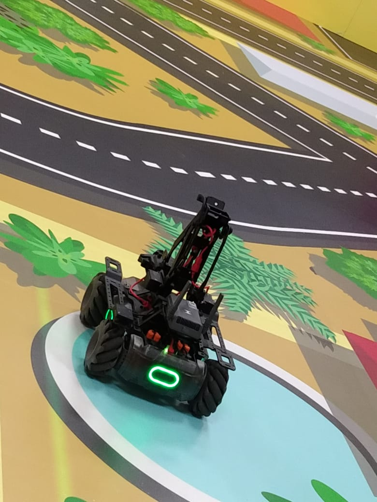

# MobileRobot-Openloopcontrol
## Aim:

To develop a python control code to move the mobilerobot along the predefined path.

## Equipments Required:
1. RoboMaster EP core
2. Python 3.7

## Procedure

Step1:Initiate the MobileRobot.
<br/>

Step2:Connect your PC with the MobileRobot.

<br/>

Step3:Open Python program.

<br/>

Step4:Program the movements of the robot using python code.

<br/>

Step5:Execute the python program.

<br/>

## Program:
```
```python
from robomaster import robot
import time

if __name__ == '__main__':
    ep_robot = robot.Robot()
    ep_robot.initialize(conn_type="ap")

    ep_chassis = ep_robot.chassis

    ## Write your code here
    from robomaster import robot
import time


if __name__ == '_main_':
    ep_robot = robot.Robot()
    ep_robot.initialize(conn_type="ap")

    ep_chassis = ep_robot.chassis
    ep_led = ep_robot.led
    
    ep_led.set_led(comp="all",r=255,g=0,b=0,effect="on")   
    time.sleep(2)
        
    ep_chassis.move(x=2.2, y=0, z=0, xy_speed=0.75).wait_for_completed()
    ep_chassis.move(x=0, y=0, z=42, xy_speed=1).wait_for_completed()
    ep_chassis.move(x=3, y=0, z=0, xy_speed=0.75).wait_for_completed()
    ep_led.set_led(comp="all",r=0,g=255,b=0,effect="on")
    ep_chassis.drive_speed(x=.25,y=0,z=-15)
    time.sleep(17)

    ep_chassis.drive_speed(x=0,y=0,z=0)
    ep_chassis.move(x=1.5, y=0, z=0, xy_speed=0.75).wait_for_completed()
    ep_led.set_led(comp="all",r=0,g=0,b=255,effect="on")
    ep_robot.close()


    
    ep_robot.close()   
    ep_robot.close()
```

## MobileRobot Movement Image:


Insert image here


<br/>
<br/>
<br/>
<br/>

## MobileRobot Movement Video:

Upload your video in Youtube and paste your video-id here

[](https://drive.google.com/file/d/16Lx66jRu4_UEHtT5HP-6WTh5ralIQhNg/view?usp=drivesdk)


[](https://drive.google.com/file/d/16_uN_q-jNsvnoPQjNCZ5WV6kO2ws3xam/view?usp=drivesdk)


<br/>
<br/>
<br/>
<br/>

## Result:
Thus the python program code is developed to move the mobilerobot in the predefined path.


<br/>
<br/>

```
Mobile Robotics Laboratory
Department of Artificial Intelligence and Data Science/ Machine Learning
Saveetha Engineering College
```
